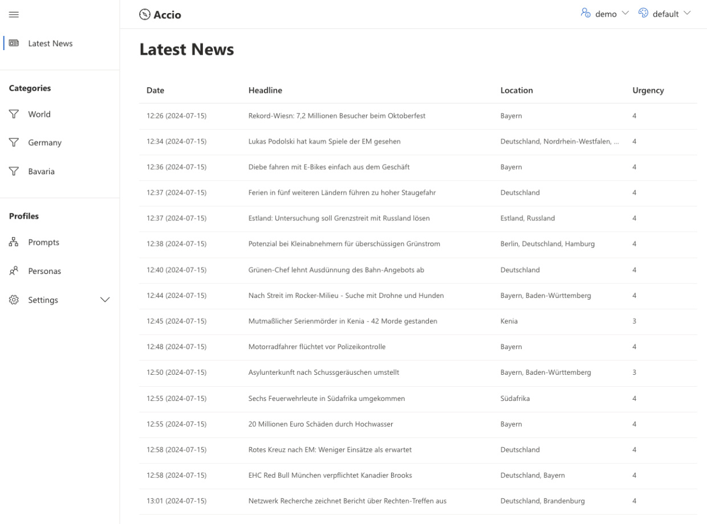
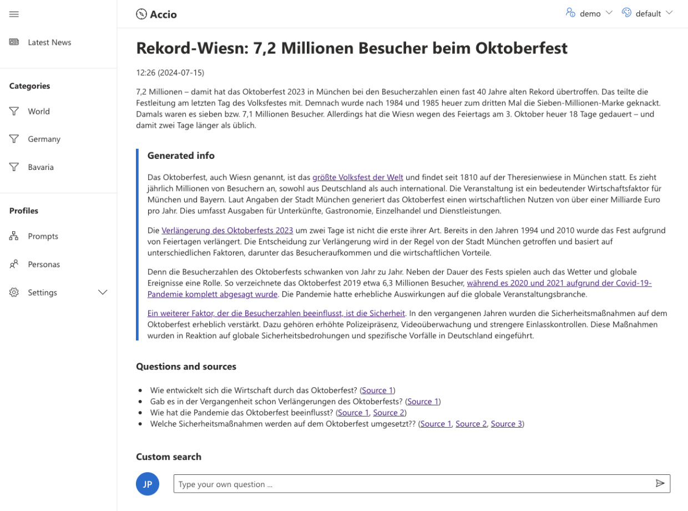

# Accio – RAG-Enhanced News (Frontend)

The prototype demonstrates how Retrieval-Augmented Generation ([RAG](https://en.wikipedia.org/wiki/Retrieval-augmented_generation)) can enhance news by incorporating additional content from a news archive. The aim is to better address the questions and needs of different user personas, providing more comprehensive and contextual information.

- **Live demo:** <https://interaktiv.br.de/accio/>
- **Presentation:** [accio-presentation.pdf](./docs/accio-presentation.pdf)

The application was created for the [AI for Media Hackathon 2024](https://aiformedia.network/apply-for-our-generative-ai-hackathon/), hosted by Bayerischer Rundfunk, pub and Microsoft.

The frontend for Accio was built with [Create React App](https://github.com/facebook/create-react-app) and [Fluent UI Starter](https://github.com/siminture/fluentui-starter).

The code and documentation for the RAG-backend service (FastAPI, LangChain) can be found here: <https://github.com/br-data/rag-enhanced-news-backend>

## Screenshots

The news editor selects a news item from a news feed. The news feeds can be customized, filtered and sorted:



With the click of a button, Accio generates follow-up questions that a reader (based on a persona) might have about a news story. Our RAG backend tries to answer these question with content from our own news archive.



Ideally, different personas could be selected and updated by the news editors, depending on the needs of different news brand. Follow-up question could be ask, using a intuitiv chat interface (not yet implemented).

## Usage

1. Clone the repository `git clone https://...`
2. Install dependencies `yarn`
3. Start development server `yarn start`
4. Build the website `yarn build`

The project requires [Node.js](https://nodejs.org/en/download/) and [Yarn](https://classic.yarnpkg.com/lang/en/docs/install/) to run locally.

The development server runs on <http://localhost:3000/>

## Authentication

The login is currently disabled in the [authentication provider](./src/global/authentication.tsx). To enable authentication set default values as following:

```tsx
export const defaultValues = {
  isAuthenticated: false,
  principal: null,
  login: (principal: any) => {},
  logout: () => {},
};
```
